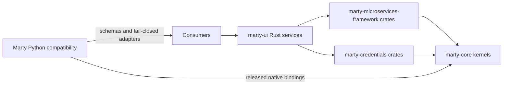

# Marty Compatibility Architecture

> **Current boundary:** this repository is not a deployable Python
> microservice stack. Do not use the historical service ports, YAML service
> names, generated gRPC clients, or modules under `src/` as deployment
> instructions. Runtime services and cryptographic kernels are owned by the
> Rust repositories listed below.

## Repository role

This repository has two supported purposes:

1. publish the independently versioned `marty-common` Python compatibility
   package; and
2. retain language bindings, schemas, and compatibility adapters until a
   consumer audit and language-neutral parity tests prove that they can be
   removed.

The root `marty-identity-compat` project is a packaging and test harness. It has
no supported root service launcher, Python plugin entry point, container image,
Helm chart, or Kubernetes deployment.

## Canonical Rust ownership

| Capability | Canonical owner | Current implementation boundary |
| --- | --- | --- |
| CSCA certificate creation algorithms and eMRTD trust/verification | `marty-core` | Rust certificate, SOD, trust-registry, and verification kernels |
| Passport issuance and document signing | `marty-credentials`, `marty-core` | Rust issuance crates and native Python bindings |
| CSCA key custody, lifecycle metadata, renewal, revocation, filtering, expiry checks, and events | `marty-ui` `signing-keys` | Authenticated Rust service, managed KMS providers, Redis CAS storage, and transactional outbox |
| Trust profiles and registry synchronization | `marty-ui` `trust-profile`, `marty-core` | Rust service and verification kernels |
| Document and presentation verification | `marty-ui` `verification` and `presentation-policy`, `marty-core` | Rust services and native verification bindings |
| Reusable service runtime, policy, storage, telemetry, and transport behavior | `marty-microservices-framework` | Shared Rust crates and language-neutral behavior contracts |
| Production deployment composition | `marty-ui` | Versioned Rust service images and deployment manifests |
| Python compatibility package | this repository | Thin native bindings, retained DTOs/schemas, and fail-closed adapters |

## Legacy capability disposition

The old Python Marty platform used service-oriented names that still appear in
schemas, tests, historical policy examples, and generated clients. A name in
this repository does not imply that a server with that name is deployed.

| Historical family | Disposition | What remains here |
| --- | --- | --- |
| `csca_service` | Executable Python service retired after Rust parity gates | Generated protobuf compatibility types only; certificate lifecycle behavior is Rust-owned |
| `document_signer` | Executable Python service retired | Generated client types and adapters that delegate canonical signing input; no local signing fallback |
| `passport_engine` | Executable Python service retired | Generated protobuf compatibility types; issuance and verification kernels are Rust-owned |
| `inspection_system` | Executable Python service retired | Generated protobuf compatibility types; verification kernels are Rust-owned |
| `dtc_engine` | Compatibility adapter retained pending consumer removal proof | Python orchestration delegates DTC canonicalization, assembly, and verification to Rust and fails closed |
| `mdl_engine` / `mdoc_engine` | Compatibility DTO/service adapters retained pending audited replacement | Security-sensitive ISO 18013 behavior is required from the released Rust native backend |
| `document_processing` | Compatibility coordinator retained pending audited replacement | MRZ/verification paths use native kernels; unavailable dependencies and mock backends fail closed |
| `pkd_service` / trust adapters | Compatibility API and data orchestration retained pending audited replacement | ASN.1, CMS, certificate, master-list, CRL, and chain validation are Rust-owned and fail closed without the native backend |
| `src/proto` and `src/marty_plugin/proto` | Retained language bindings | Generated wire schemas for compatibility consumers, not runtime ownership or endpoint availability |

The retained adapters are not permission to reintroduce Python cryptographic
or protocol kernels. They may translate DTOs, coordinate calls, or expose
compatibility interfaces, but synthetic success and silent fallback are
prohibited.

## CSCA parity record

The historical CSCA API exposed the following intended operations:

- get CSCA certificate data;
- create a certificate;
- renew a certificate;
- revoke a certificate;
- get certificate status;
- list certificates with filters; and
- check for expiring certificates.

The Rust ownership split preserves those behaviors. `marty-core` owns key
algorithm and certificate correctness. `marty-ui/signing-keys` owns managed key
custody and the lifecycle API, including authenticated import, status,
filtering, renewal lineage, idempotent revocation, expiry queries, durable
metadata, and issued/renewed/revoked outbox events. Private key material is not
accepted or returned by the lifecycle API.

Supported CSCA signing algorithms are represented by stable Rust contract
values for RSA 2048/3072/4096 and ECDSA P-256/P-384/P-521. An omitted algorithm
preserves the historical P-256 default. Issuer signing choice is independent of
the child document-signer certificate key type.

## Configuration boundary

Files such as `config/development.yaml`, `config/testing.yaml`, and
`config/production.yaml` are retained compatibility fixtures and historical
policy inputs. They are not consumed by the Rust deployment composition and
must not be used to infer that a named Python service or port is available.

New runtime settings belong with the owning Rust crate or service. New
language-neutral compatibility requirements belong in a versioned contract and
must have tests on both sides of the boundary.

## Release and deployment boundary

The retired `ghcr.io/elevenid/marty` package and the historical
`ghcr.io/elevenid/charts/marty` Helm OCI package bundled the obsolete Python
root plugin delivery surface. They were deleted only after package inspection,
consumer-zero evidence, and retained rollback evidence. Neither package is a
source directory or a current deployment dependency.

Use immutable artifacts, SBOMs, checksums, and attestations published by the
canonical Rust owners. Production changes are intentionally outside this
repository. Beta deployments are performed from `marty-ui` only.

## Removal gate for retained compatibility code

A retained Python module, schema, configuration name, or generated client may
be deleted only when all of the following are recorded:

1. repository, release-artifact, and deployment consumer searches are empty;
2. every supported behavior has a canonical Rust owner;
3. language-neutral golden vectors or behavior contracts pass at the Rust and
   compatibility boundaries;
4. fail-closed and negative-path behavior has equivalent coverage;
5. the replacement has landed through review and CI; and
6. rollback artifacts, SBOMs, attestations, and checksums remain recoverable.

This gate prevents cleanup from becoming accidental feature removal.
